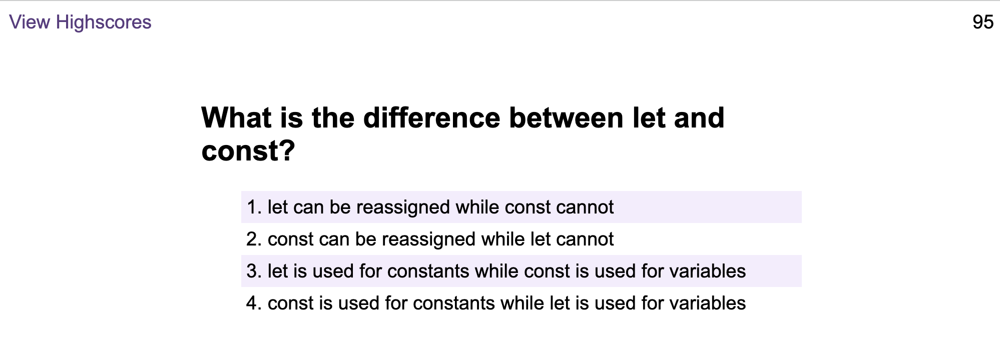

# code-quiz

A timed coding quiz that runs in the browser, with multiple-choice questions, developed with JavaScript, CSS and HTML. The quiz can be started here: 
https://rararach-l.github.io/code-quiz/ 

# Description
A code quiz designed to practice for interview tests. 

* When the start button is clicked, a timer starts counting down from 100 and the first question appears.
* Each questions has four options, one can be selected by clicking
* When an answer is clicked, a sound will indicate whether it is correct or wrong, and the next question appears
* If the answer was incorrect, time will be subtracted time from the clock
* The quiz will end when all questions are answered or the timer reaches 0.

# Installation
The programme will run in the browser.

# Usage
The quiz has three pages, as follows:

# Credits
This program was created following classes on front end development via trilogy eduction.

# License
Please refer to the LICENCE in the repo.